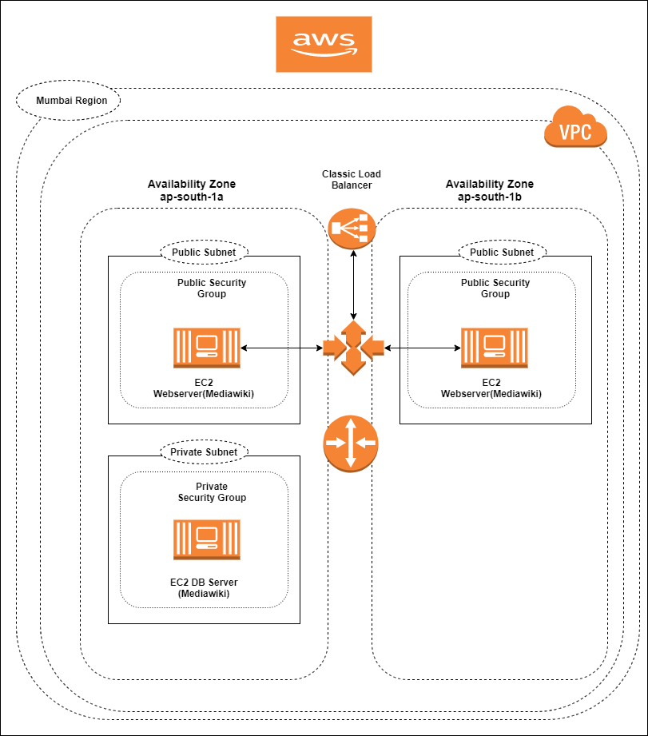

##MediaWiki Assignment

##### Diagrams - Tech Stack Architecture

[1] Please provide AWS_ACCESS_KEY and AWS_SECRET_KEY details under terraform.tfvars file

``aws_access_key = "xxxxxxxxx"``
``aws_secret_key = "xxxxxxxxx"``

[2] To create new tech stack
    
``terraform init``

``terraform plan -var desired_count=2 --var scale_min=1 --var scale_max=3``

``terraform apply -var desired_count=2 --var scale_min=1 --var scale_max=3``

[3] To scale up tech stack for app tier

``terraform apply -var desired_count=3 --var scale_min=1 --var scale_max=3``

[4] To scale down tech stack for app tier

``terraform apply -var desired_count=1 --var scale_min=1 --var scale_max=3``

NOTE - For deploying the mediawiki tar content to app severs that part is handled using Ansible playbooks as well as setting up db server steps also handled in ansible playbooks.

It is assumed that these configuration steps will be performed from some centralized server or jenkins server. So actual application will not be visible on tech stack creation.